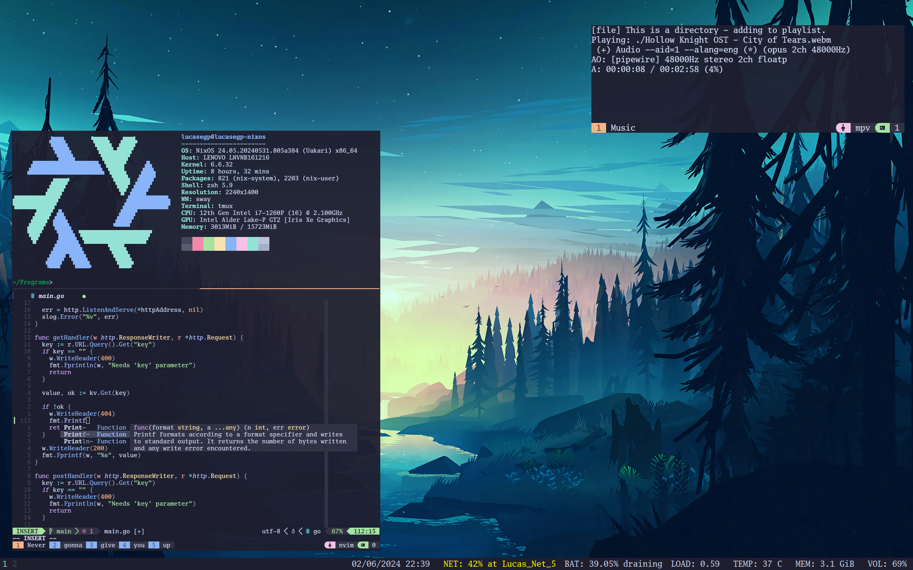

# Configs

This repository contains the configurations I use in my main nixos system. Do not judge the code, I am still learning about how nix works...

## How to use this repository

First, get a nixos installer, setup your partitions, and when the installer says to edit the configuration.nix file return here.

Then, if you are not me using my computer (probably the case if you are reding this readme), copy the hardware-configuration.nix file from the hardware scan the installer did somewhere safe.

After that, clone this repo into the place where the hardware-configuration.nix was (probably /mnt/etc/nixos/) and overwrite this repo's file with the one you stored earlier.

Finally, install nixos with nixos-install!

## How does it look?
Glad you asked!

